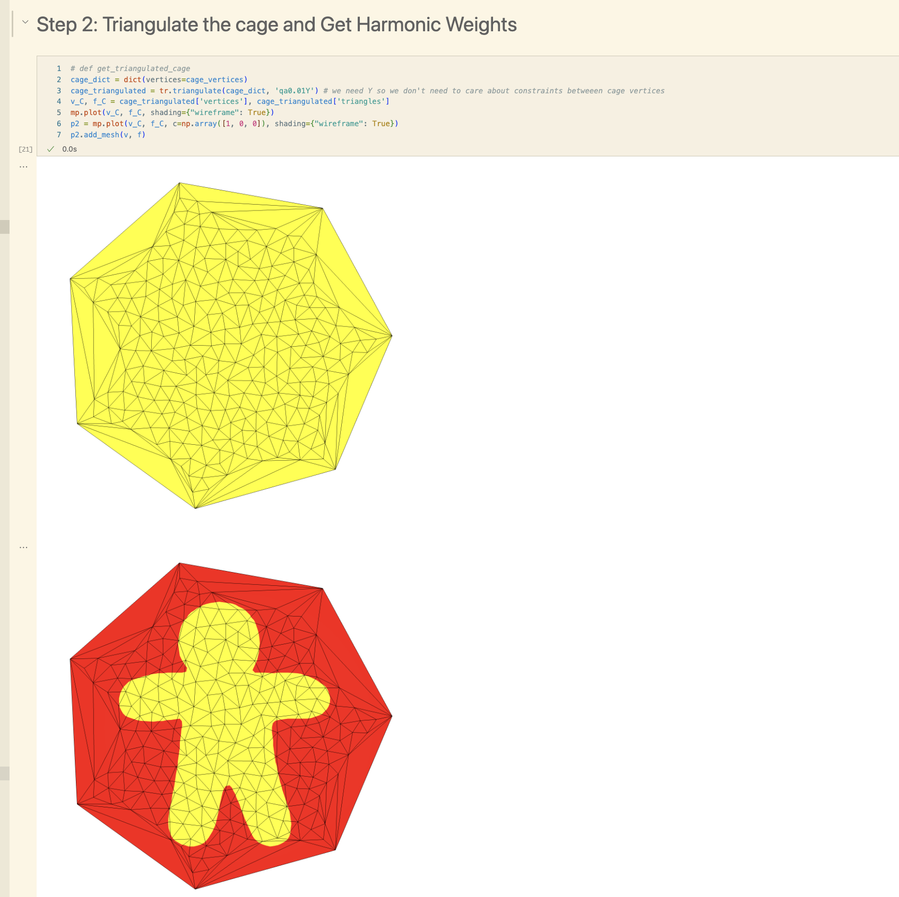

# Paper 

# Description 

## Theory 

Using harmonic coordinates for mesh deformation is a cage-based deformation, which is a space-based deformation. So, we first define a cage, then based on the enclosed mesh's location, we can move the mesh vertices accordingly as a linear combination of the cage vertices' positions. The theory is as follows, with some notation changed for convenience with code correspondance. Given a harmonic function $h_{\vec{p}}(i)$ which denotes the harmonic weight of point $\vec p$ in Euclidean space in terms of the $i^{th}$ cage vertex, we can define 

$\vec p = \sum_{i=1}^{n} h_{\vec{p}}(i) \vec c_i$

where $\vec c_i$ is the $i^{th}$ cage vertex. We also need to satisfy the condition that the Laplacian of the harmonic function is zero. Finally, we must satisfy the condition that $h_{\vec{p}}(i) = 1$ if $\vec p = \vec c_i$ and $0$ if $\vec p = \vec c_j$ for $i \neq j$.

However, to achieve this implementation, we are going to make a triangle mesh out of the cage, called mesh $C$, which encloses mesh $S$, then use which triangle in mesh $C$ each vertex of $S$ belongs as the spatial marker instead. Observe, since it is a space-based deformation of $S$, there is no notion of the geometry of $S$, and so $S$'s faces and vertices that affects the deformation. Instead, we are finding where the vertices in $S$ are in space in relation to $C$, then using the harmonic coordinates to get new positions. This will allow us to get the harmonic weights simply using the libigl function `igl.harmonic`.

## Initial misconceptions 

When I was first trying to understand harmonic coordinates for character articulation, I had some difficulty separating the theory and implementation. In theory, the idea is that each vertex of $S$ is mapped to a harmonic coordinate which describe harmonic weights for each cage vertex `cage_vertex_i`. However, it was not clear how mesh $C$ is needed and why it is different from $S$. Essentially, what we are doing is using the Laplace Beltrami for the mesh in $C$, and this discretization is what allows us, practically, to get harmonic weights in $S$. 

## Project Overview

What I did is allow the user to create a cage around a Gingerbread man mesh, then triangulate the cage, then get the harmonic weights of the cage vertices. Then, I allow the user to create a mesh, and then get the barycentric interpolation of the harmonic weights of the cage vertices in the mesh. Finally, I allow the user to deform the cage, and see the mesh deform accordingly. All of this is done in 2D. 

# Step 1: Create a cage 

Goal: We want to have a set of cage vertices `cage_vertex_i` which enclose the mesh. 

There are many ways to do this, and you are often given them, or the user will choose the vertices themselves. For example, the user chooses their own enclosing (not implemented as this is just GUI work). In this project, I will allow for the mesh to be created by creating an N-gon, then allowing for zooming in and out and rotating the cage, and moving each vertex of the cage to what they want. Something I am not doing is making sure the Gingerman mesh is enclosed by the cage, but this can be done by the user visually.

Outputs: 

- The cage and the mesh $S$ enclosed. 

# Step 2: Triangulate the cage and Get Harmonic Weights

We want to develop a mesh out of the cage called mesh $C$. The more fine the cage mesh, the more effective the deformation. To achieve this, we can simply use the `triangle` module, which is permitted by the TA Arvi. Once we triangulate the cage, we can then express it in harmonic coordinates. We do this using `igl.harmonic_weights`, which is also allowed by the professor. Under the hood, this is done by setting the Laplacian of the coordinate function for mesh $C$ to zero, meaning that the mesh connectivity and vertices of mesh $C$ affects the result, as expected. We also assert that the sum of all harmonic weights for each vertex in mesh $C$ is 1.

The boundaries vertices we need to set are the vertices of the cage $C$, and the boundary conditions is that the $i-th$ harmonic weight of the $j-th$ cage vertex is $1$ if $i == j$ and $0$ otherwise. We store in this in `h`, whereby `h[c, i]` depicts 

$h_{\vec{C_c}}(i)$ :- harmonic weight of the $i^{th}$ vertex in the mesh $C$ in terms of the $c^{th}$ cage vertex. 

Outputs: 

- The cage vertices, the cage vertices triangulated (mesh $C$)
- The visualization of the harmonic weights for each cage vertex over all vertices in $C$.  It can be observed that the harmonic weights are 1 for the cage vertices and 0 for the other vertices.

# Step 3: Get Barycentric-Interpolated Harmonic Weights in Enclosed Mesh 

Now, given the enclosed mesh $S$, we essentially want to get the harmonic weights of each vertex in $S$. Since it won't make sense to get harmonic weights of vertices in $S$ directly (since it is a space-based deformation), what we do in this discretized world is to get the barycentric interpolation of the harmonic weight value in the space of $C$. More formally, 

We store the result in `h_p`, whereby `h_p[s, i]` depicts

&nbsp;&nbsp;&nbsp;&nbsp;&nbsp;&nbsp;
$h_{\vec{S_s}}(i)$ :- harmonic weight of the $j^{th}$ vertex in the mesh $S$ in terms of the $i^{th}$ cage vertex.

If $v$ of mesh $S$ is spatially located in the triangle of vertices $k, l, r$ in mesh $C$, we have that 

&nbsp;&nbsp;&nbsp;&nbsp;&nbsp;&nbsp;
$h_{\vec{S_s}}(i) = \alpha_k h_{\vec{C_k}}(i) + \alpha_l h_{\vec{C_l}}(i) + \alpha_r h_{\vec{C_r}}(i)$

where $\alpha_k, \alpha_l, \alpha_r$ are the barycentric weights of $v$ in the triangle $k, l, r$. To achieve this, we first find the indexes $i, j, k$ and barycentric weights. Then, we simply get $W(v)$ by barycentric interpolation. Again, we assert that the sum of all harmonic weights for each vertex in mesh $S$ is 1.

Output: 

- The visualization of harmonic weights for each cage vertex over all vertices in $S$.

# Step 4: Calculate New Mesh Vertices 

Now, we are ready to apply the equation $\vec p = \sum_{i=1}^{n} h_{\vec{p}}(i) \vec c_i$. Weights will never change throughout because we are in a space-based deformation, so we can calculate it once from previous steps. We can then move the vertices of $S$ accordingly, and simply update the mesh.

Output: 

- Interactive deformation of cage vertices

Example after deformation:

