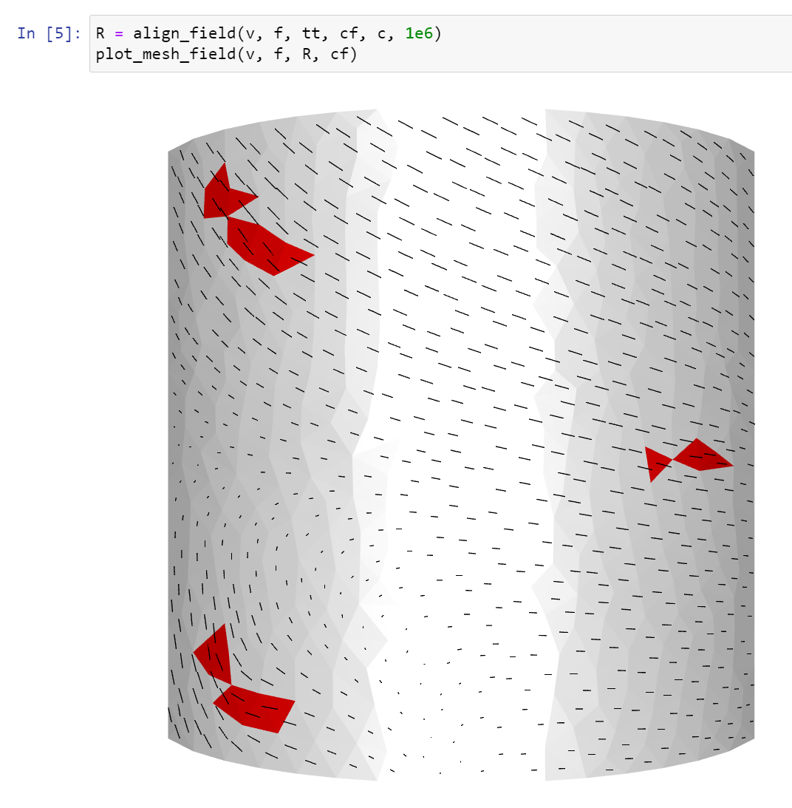
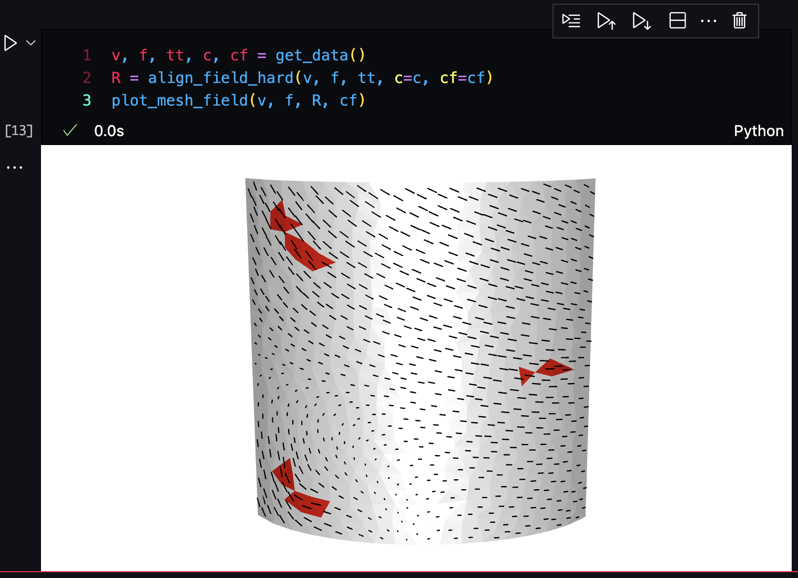
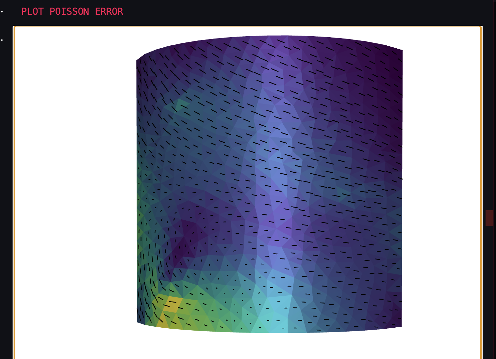

# Geometric Processing

<!-- make title link to implicit reconstruction file -->
## [Mesh Implicit Reconstruction](Implicit_Reconstruction_MLS.ipynb)

<!-- create a table -->
| Input | Output |
| --- | --- |
|  | <video src="https://github.com/user-attachments/assets/9db6b018-8241-4314-99aa-4251050acd10" alt="Output" width="200"/> |

## [Laplacian smoothing and deformation](Laplacian_Surface_Editing.ipynb)

<!-- create a table -->
| Input --> Smoothing --> Deformation -->  Output | Real-time deformation |
| --- | --- |
|    | <video src="https://github.com/user-attachments/assets/b18023d8-0516-4258-b2a1-dca16a3438bc" alt="Output" width="200"/> | 

## [Cage-based harmonic coordinates deformation](Cage_Based_Deformer.ipynb)

<!-- create a table -->
| Input | Cage | Output | Demo |
| --- | --- | --- | --- |
|  |  |  | <video src="https://github.com/user-attachments/assets/50a8fb32-a362-4079-bb0f-38ba13b548dc" alt="Output" width="200"/> | 

<!-- strikethrough -->
## [Vector field Poisson reconstruction + Mesh Parametization] (Vector_Field_Reconstruction.ipynb)

Red are constraint vectors.
<!-- create a table -->
| Input given using soft constraints | Using hard constraints | Calculated Poisson Error | 
| --- | --- | --- |
|  |  |  |

<!-- poisson_reconstruction_error -->
<!-- reconstructed_vf -->
<!-- vf_input -->

### Installation of Meshplot 
`%pip install git+https://github.com/skoch9/meshplot.git`
`pip install ipywidgets`
`pip install pythreejs`

### Topics

* Geometry Acquisition
* Surface Reconstruction
* Normal Estimation and PCA
* Basic Differential Geometry of Curves and Surfaces
* Mesh smoothing and optimization
* Mesh Parametrization
* Mesh Deformation and Editing
* Space Deformations

### Acknowledgements
*Daniele Panozzo*