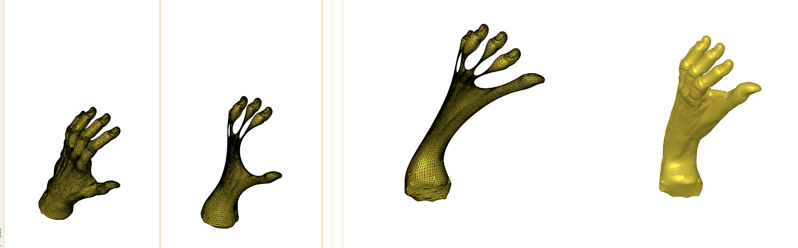

# Geometric Processing

### Course Instructor
*Daniele Panozzo*

<!-- make title link to implicit reconstruction file -->
## [Mesh Implicit Reconstruction](Implicit_Reconstruction_MLS.ipynb)

<!-- create a table -->
| Input | Output |
| --- | --- |
|  | <video src="https://github.com/user-attachments/assets/9db6b018-8241-4314-99aa-4251050acd10" alt="Output" width="200"/> |

## [Laplacian smoothing and deformation](Laplacian_Surface_Editing.ipynb)

<!-- create a table -->
| Input --> Smoothing --> Deformation -->  Output | Real-time deformation |
| --- | --- |
|    | <video src="https://github.com/user-attachments/assets/b18023d8-0516-4258-b2a1-dca16a3438bc" alt="Output" width="200"/> | 

## Cage-based harmonic coordinates deformation

<!-- create a table -->
| Input | Cage | Output | Demo |
| --- | --- | --- | --- |
|  |  |  | some video |

<!-- strikethrough -->
## ~~Vector field reconstruction~~

<!-- create a table -->
| Input | Output |
| --- | --- |

## Course Description
*Uses libigl*

Recent advances in 3D digital geometry processing have created a plenitude of novel concepts for the mathematical representation and interactive manipulation of geometric models. This course covers some of the latest developments in geometric modeling and digital geometry processing. Topics include surface modeling based on polygonal meshes, surface reconstruction, mesh improvement, mesh parametrization, discrete differential geometry, interactive shape editing, skinning animation, architectural and structure-aware geometric modeling, shape modeling, with an eye on 3D printing. The students will learn how to design, program and analyze algorithms and systems for interactive 3D shape modeling and digital geometry processing.

You will learn how to implement advanced geometry processing algorithms using Python and libigl.

By the end of the course, you will be able to design, program, and analyze algorithms and systems for 3D shape modeling and digital geometry processing.

### Topics

* Geometry Acquisition
* Surface Reconstruction
* Normal Estimation and PCA
* Basic Differential Geometry of Curves and Surfaces
* Mesh smoothing and optimization
* Mesh Parametrization
* Mesh Deformation and Editing
* Space Deformations
* Skeletal Animation and Skinning

### Textbook
*Polygon Mesh Processing*
Mario Botsch, Leif Kobbelt, Mark Pauly, Pierre Alliez
A K Peters/CRC Press
Textbook - 250 Pages
ISBN 1568814267

https://github.com/danielepanozzo/gp
